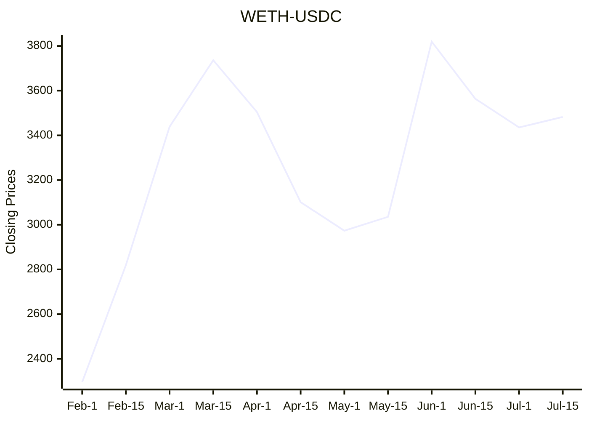

# Readme Crypto Price Chart

Display live cryptocurrency price charts directly in the README.md file. 

<!-- CHART_START -->

<!-- CHART_END -->

## How it works

This project uses a GitHub Actions workflow to periodically fetch the latest cryptocurrency prices from CoinGecko's public DEX APIs. The data is processed and used to update this README.md file, rendering a chart with the latest information using mermaid.js.

The workflow is defined in the `main.yml` file, located in the `.github/workflows` directory. It runs on a schedule, specified using cron syntax, and updates the chart data between the `<!-- CHART_START -->` and `<!-- CHART_END -->` markers in the README.md file.

## How to Set Up

To set up this project:

1. **Clone the Repository**: Clone this repository that includes the `main.yml` file in the `.github/workflows` directory.

2. **Ensure Write Permissions**: Grant the repository write permissions to update the README.md file. You can do this by navigating to the repository's Settings > Actions > General > Workflow permissions.

3. **Customize Your Setup**: You can modify various settings in the `main.yml` file, such as the cryptocurrency pair, chain, and update frequency.

4. **Update Your README.md**: Include the following markers in your README.md file where you want the chart to appear:

```markdown
  <!-- CHART_START -->
    *Chart will be dynamically inserted here.*
  <!-- CHART_END -->
```

### Yaml Configuration (`main.yml`)

The main.yml file contains the workflow configuration. Below is an example setup:

```yaml
  on:
  schedule:
    - cron: '0 0 */1 * *' # Runs once every day

  jobs:
    update-readme:
      steps:
      - name: Fetch Chart data
        env: 
          TITLE: WETH/USDC # Title of the chart
          CHAIN: eth # Chain - eth/bsc/polygon_pos/avax/movr/cro/one/boba/ftm/bch, check entire list: https://api.geckoterminal.com/api/v2/networks
          POOL: '0x88e6a0c2ddd26feeb64f039a2c41296fcb3f5640' # Pool pair address
          TIMEFRAME: day # Timeframe - day/hour/minute
          AGGREGATE: 1 # Aggregate options - day: [1], hour: [1, 4, 12] minute: [1, 5, 15]
          LIMIT: 365 # Limit - 100 to 1000, changing this may require modification to code below to fit the data
```

## Contributions

Contributions are welcome! Please submit issues or pull requests with any improvements, new features, or bug fixes.

## License

This project is licensed under the MIT License - see the [LICENSE](LICENSE) file for details.
